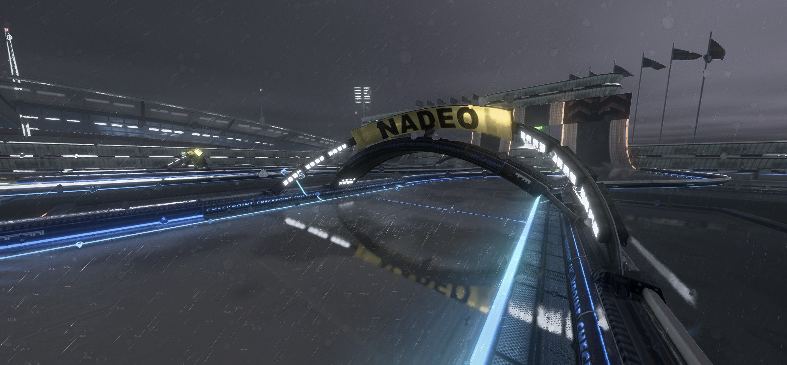
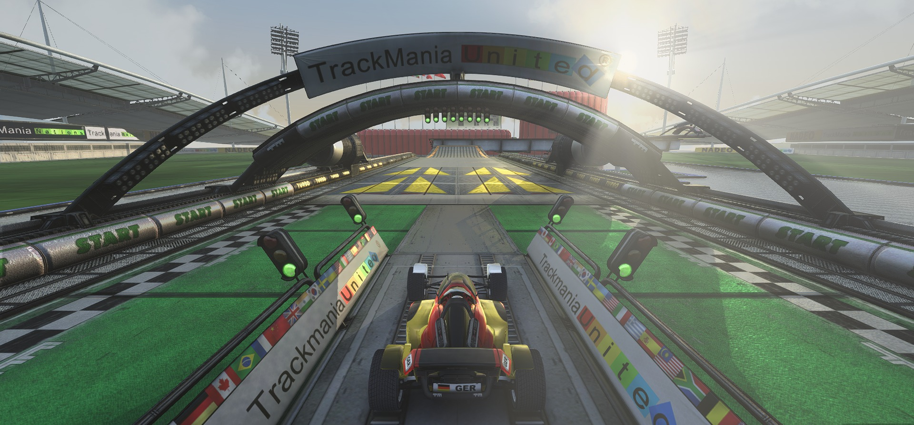
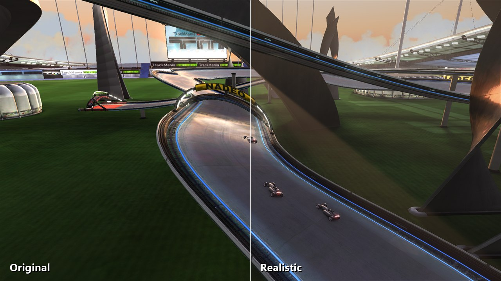

# TM Vibrant Shaders

**Real-time lighting, weather and skies for TrackMania Nations Forever and United Forever.**

A Direct3D 9 mod that lights the game again: shadows, ambient occlusion, light shafts, bounce light, glowing neon, rain with sound and lightning, wet roads with reflections, water, volumetric clouds and new skies. It draws inside the game's renderer, before the HUD, so the interface stays sharp. It works while driving, in replays and in the video export.

**[Download the latest release](https://github.com/cheatoskar/TM-Vibrant-Shaders/releases/latest)** · [Install](#install) · [Features](#features) · [Presets](#presets) · [Controls](#controls) · [Documentation](#documentation)

---

## Install

1. Download **`TM-Vibrant-Shaders.zip`** from the [latest release](https://github.com/cheatoskar/TM-Vibrant-Shaders/releases/latest) and extract the whole zip.
2. Close TrackMania and run **`TM-Vibrant-Shaders-Setup.exe`**.
3. Choose where to install:

   | Button | When to pick it |
   |---|---|
   | **Install for the TrackMania ModLoader** | You use the [ModLoader (TMLoader)](https://tomashu.dev/software/tmloader/). Afterwards tick *TM Vibrant Shaders* in your ModLoader profile. |
   | **Install into TrackMania Nations Forever** / **United Forever** | No ModLoader. The setup lists every TrackMania it finds, each with its own button, and puts a `d3d9.dll` next to `TmForever.exe`. |
   | **Install into another game folder** | Your game isn't in the list. Pick the folder that contains `TmForever.exe`. |

4. Start the game. Press **`F8`** for the menu.

Run the setup again to update or uninstall; your settings stay. Windows SmartScreen may warn because the setup isn't code-signed: *More info → Run anyway*, or install by hand. Manual install, updating and the recommended game settings: **[docs/install.md](docs/install.md)**. Deutsche Anleitung: **[docs/INSTALL_DE.md](docs/INSTALL_DE.md)**.

---

## Features

| | |
|---|---|
| **Light and shadow** | Ambient occlusion. Sun shadows, plus long-range shadows from a height map of the track that builds up while you drive, so a low sun casts long shadows from objects off screen too. Light shafts, volumetric light with shadows in the haze, bounce light (one bounce of coloured light), neon borders that light up the road around them. |
| **Weather** | Rain as particles that streak with the camera, splashes, ripples, streams down walls, drops on the lens. Wet roads and puddles with reflections. Thunderstorms with lightning bolts and flashes. Spray behind the car. |
| **Sound** | Rain and thunder from real recordings: a rain loop that follows the rain amount and ten different thunders, from close cracks to far rumbles. Each strike sounds a little different and comes from the side of the flash. |
| **Water** | Pools, rivers and the TMUF seas get waves, refraction and reflections. The mod takes the water height from the game, so nothing else turns into water. |
| **Sky** | Volumetric clouds. Clear sky, starry night with shooting stars, aurora, a black hole that bends light, and the Ring World: Saturn, Jupiter, an ice giant or an exotic planet, seen from far away, next to the rings or right above them. Night skies work on day maps. |
| **Camera** | HDR bloom, auto exposure, filmic tone curve. FXAA, temporal anti-aliasing, AMD CAS sharpening. Motion blur and depth of field that switch on by themselves in replays and the video export. |
| **Extras** | A neon light trail behind your car for the whole run. Track reflections up to a mirror finish. Grass detail and mowing stripes. |
| **Comfort** | `F8` menu with a *Simple* and an *Advanced* view. Auto quality holds your frame rate. A live per-effect cost panel. A preset per map mood (day, sunset, night). Your own presets as shareable text files. |

| | |
|---|---|
|  |  |
|  |  |
|  |  |

---

## Presets

| Preset | Look |
|---|---|
| **Vibrant** | The default. Warm sun, rich colours, glowing borders, light shafts. |
| **Realistic** | TrackMania's own colours and sky. Only the light is new: shadows, ambient occlusion, bounce light, a little haze. |
| **Golden Hour** | Clear sky, low warm sun, long light shafts. |
| **Dreamy** | Soft pastel bloom, pink and teal. |
| **Neon** | Starry night, bright neon that lights up the whole track. |
| **Horizon** | The Ring World at night: a ringed gas giant and a glowing black hole over a dark stadium. |
| **Aurora** | Northern lights, green and teal. |
| **Rainy Day** | Overcast, wet track, puddles, rain. |
| **Storm** | Low clouds, pouring rain, deep puddles, lightning and thunder. |
| **Replay Cinema** | Film look with motion blur and depth of field, for replays and the video export. |
| **Competition** | Clarity first: AO and contact shadows, no haze or lens effects. |
| **Performance** | Vibrant with the expensive parts off. |

By default the mod picks **Vibrant** on day maps, **Golden Hour** on sunset maps and **Horizon** on night maps. Change it under *Which preset for which maps* in the menu. Every sky works with every preset. Change any value and the preset becomes *Custom*; save it under your own name in the *Advanced* view.

---

## Controls

| Key | Action |
|---|---|
| `F8` | Open or close the menu |
| `F7` | Shaders on or off, for a before/after look |
| `F12` | Save a screenshot and a frame capture (attach both to bug reports) |

Settings, presets and the log live in `Documents\TrackMania\TMVS\`. Everything is saved automatically.

---

## Performance

- **Runs on:** any GPU with Shader Model 3.0, from Intel UHD 620 and GTX 750 upwards. Pick *Performance* and *Effect quality: Low* on weak GPUs.
- **Comfortable at 1080p:** GTX 1060, RX 580, Radeon 780M, Intel Arc 140V.
- **Everything on at 1440p:** RTX 3060, GTX 1080 Ti and faster.

**Auto quality** is on by default. It turns the effect quality down when your frame rate drops below the target and back up when there is room, without touching your settings. The *Performance* section in the menu shows what each effect costs on your GPU, live. Measured numbers and the most expensive settings: **[docs/performance.md](docs/performance.md)**.

---

## Compatibility

| | |
|---|---|
| TrackMania Nations Forever | Yes |
| TrackMania United Forever | Yes (the mod detects the game build and the map's environment) |
| TrackMania Nations ESWC, TrackMania 2 / 2020 | No |
| TrackMania ModLoader (TMLoader) | Yes, or without it as `d3d9.dll` |
| Other `d3d9.dll` mods (ReShade and similar) | Not as `d3d9.dll` in the same game folder. Together with the ModLoader install: untested |
| Windows | 10 and 11 |

---

## Documentation

| Page | Contents |
|---|---|
| [Installation](docs/install.md) | Setup, manual install, ModLoader or game folder, updating, uninstalling, recommended game settings |
| [Settings](docs/settings.md) | Every setting in the menu, mood presets, your own presets |
| [Performance](docs/performance.md) | Hardware, measured costs, what to turn off for more FPS |
| [Troubleshooting](docs/troubleshooting.md) | No effects, no sound, low FPS, HUD problems, how to report a bug |
| [How it works](docs/how-it-works.md) | Hooks, depth buffer, the render passes, the two game builds |
| [Building](docs/building.md) | Build from source, the offline previewer, project layout |
| [Installation (Deutsch)](docs/INSTALL_DE.md) | Installation und Bedienung auf Deutsch |
| [Changelog](CHANGELOG.md) | What changed in each version |

---

## Development Note

This mod was developed with the help of [Claude Code](https://claude.com/claude-code). The ideas, presets, design and testing are my own, with AI assisting throughout the development process. If you find a bug, please report it in the [issues](https://github.com/cheatoskar/TM-Vibrant-Shaders/issues).

---

## Credits

- [Dear ImGui](https://github.com/ocornut/imgui) (MIT) for the menu, [minimp3](https://github.com/lieff/minimp3) (CC0) for the sound. See [THIRD_PARTY_NOTICES.md](THIRD_PARTY_NOTICES.md).
- Rain and thunder recordings from [freesound.org](https://freesound.org) (CC0) by Rubaoliva, loganzsound, seth-m, Fission9, TRP, Kinoton, Martineerok, kingsrow and bastipictures. See [sounds/CREDITS.md](sounds/CREDITS.md).
- Anti-aliasing and sharpening follow FXAA 3.11 (Timothy Lottes) and AMD FidelityFX CAS. The look is inspired by the Minecraft shader packs Sildur's Vibrant, BSL and IterationT; no code from them is used.
- TrackMania is a trademark of Ubisoft / Nadeo. This is a fan project and has nothing to do with them.

## License

© 2026 Oskar (cheatoskar). [MIT License](LICENSE). Third-party parts keep their own licenses ([THIRD_PARTY_NOTICES.md](THIRD_PARTY_NOTICES.md)).
