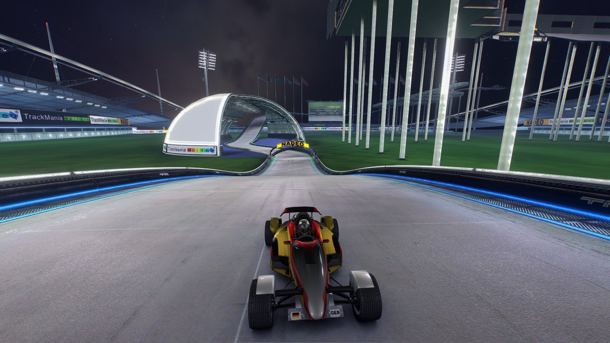

# TM Vibrant Shaders

> [!WARNING]
> **Beta.** The shaders work, but the presets are still being tuned, so the look will change between versions.
> Bug reports and screenshots (`F12` captures) are very welcome in [Issues](https://github.com/cheatoskar/tmnf-vibrant-shaders/issues).
> The code is public to read, but it is **not open source yet**. Please don't redistribute it or publish modified versions until the final release ([license](LICENSE)).

**Real-time shaders for TrackMania Nations Forever and TrackMania United Forever**, in the spirit of Minecraft shader packs like Sildur's Vibrant, BSL and IterationT.

The plugin hooks into the game's renderer. It reads the depth buffer, camera and sun, then rebuilds the lighting. You get ambient occlusion, sun shadows, light shafts, HDR bloom, fog and custom skies, all drawn under the HUD, so the interface stays sharp.


| | |
|---|---|
|  |  |
|  |  |

---

## Features

**Lighting**
- **Ambient occlusion.** Horizon-based and normal-aware. It grounds blocks, barriers and cars.
- **Sun shadows.** Rays are traced against the depth buffer in the game's real sun direction.
- **Sun and sky light.** Sunlit surfaces take on the warm sun colour. Shadows and occluded areas take on the sky colour.
- **Light shafts and height fog.** Volumetric-looking rays and atmospheric haze, with sun scattering.

**Image**
- **HDR reconstruction.** Neon borders, lamps and floodlights become real light sources that glow, while large bright surfaces stay surfaces.
- **Bloom, auto exposure and filmic tone mapping.** Highlights roll off smoothly instead of clipping to white.
- **FXAA and contrast-adaptive sharpening.** Edges stay clean without the game's MSAA.

**Skies**
- **Clear sky.** Procedural atmosphere with drifting clouds.
- **Starry night.** Milky Way, moon and stars.
- **Black hole.** Light is ray-traced through curved space-time (Schwarzschild geodesics), so the photon ring and the lensed accretion disk come out of real light bending. A ringed gas giant can be added.
- **Aurora borealis.** Soft, folding curtains of light.

**Convenience**
- **Map mood detection.** Day, sunrise/sunset and night are detected automatically, and each mood gets its own preset (for example Vibrant by day, Event Horizon at night).
- **In-game menu (F8).** Every parameter can be changed live. You can save your own named presets.
- **Automatic saving.** Every change is saved as you play.
- **Replays and video export.** The shaders also apply when replays are rendered.

---

## Presets

| Preset | Look |
|---|---|
| **Vibrant** | Sildur's-style: saturated, warm sun, glowing borders. The default. |
| **Cinematic** | IterationT-style: dense sunlit haze, deep shadows, film contrast. |
| **Balanced** | BSL-style: natural light, soft bloom, cool shadows. |
| **Golden Hour** | Procedural clear sky, low warm sun, long light shafts. |
| **Dreamy** | Soft pastel bloom with pink and teal toning. |
| **Neon Night** | Starry night sky, day-for-night grading, glowing neon. |
| **Event Horizon** | Black hole and ringed planet over a dark, cold stadium. |
| **Aurora** | Northern lights over the stadium, green and teal grade. |
| **Competition** | Clarity first: AO and contact shadows, no haze or lens effects. |
| **Performance** | Same look with fewer samples and no shafts, for weak GPUs. |

Change any value and the preset becomes **Custom**. Use **Save as preset** to keep it under your own name.

---

## Installation

**Requirements**
- TrackMania Nations Forever or United Forever on Windows 10/11.
- A GPU with Shader Model 3.0 and INTZ depth textures. Any NVIDIA, AMD or Intel GPU from the last ~12 years has both.
- Optional: the [TrackMania ModLoader (TMLoader)](https://tomashu.dev/software/tmloader/). The mod also works without it.

### Setup (recommended)
1. Download **`TM-Vibrant-Shaders.zip`** from [Releases](https://github.com/cheatoskar/tmnf-vibrant-shaders/releases) and extract it.
2. Close TrackMania, then run **`TM-Vibrant-Shaders-Setup.exe`** and choose one of:
   - **Install for the TrackMania ModLoader.** Then tick *TM Vibrant Shaders* in the ModLoader and start the game.
   - **Install into the game folder (no ModLoader).** Select your TrackMania folder (the one with `TmForever.exe`), then start the game as usual. Windows asks for admin rights if the game is in *Program Files*.

Run the setup again to update or uninstall. It isn't code-signed, so Windows SmartScreen may warn. Choose *More info → Run anyway*, or install by hand (below). Every release lists SHA-256 checksums.

### By hand
- **ModLoader:** copy the folder `TM Vibrant Shaders` from the zip to `%LOCALAPPDATA%\TMLoader\database\TmForever\products\`, then tick the mod in the ModLoader.
- **Without ModLoader:** copy `TM Vibrant Shaders\<version>\TMVibrantShaders.dll` into your TrackMania folder (next to `TmForever.exe`) and rename it to **`d3d9.dll`**. This doesn't work together with another `d3d9.dll` such as ReShade.

Eine deutsche Anleitung gibt es in [docs/INSTALL_DE.md](docs/INSTALL_DE.md).

---

## Usage

| Key | Action |
|---|---|
| `F8` | Open or close the shader menu. |
| `F7` | Shaders on/off, for a quick before/after comparison. |
| `F12` | Save a frame capture to the TMVS folder (useful for bug reports). |

- **Preset per map mood.** With this enabled, the preset you pick on a day, sunset or night map is remembered for that mood and applied automatically next time.
- **Effect quality** (*Image* section). *Low*, *Medium* or *High* changes the AO and shadow sample counts.
- **Sky** (*Sky & Atmosphere* section). Choose a custom sky. *Sky rotation* turns the black hole, planet and aurora into view.
- Settings, your presets and the log live in `Documents\TrackMania\TMVS\`.

---

## Performance

Measured cost of the whole pipeline at 1920×1080 on an Intel Arc 140V (integrated GPU):

| Preset | GPU time per frame |
|---|---|
| Performance | ~2.5 ms |
| Vibrant, sun out of view | ~3.0 ms |
| Vibrant, looking into the sun | ~4.5 ms |
| Event Horizon (with black hole sky) | ~4.6 ms |

Light shafts are skipped automatically when the sun isn't on screen. On a dedicated GPU the cost is a fraction of this.

---

## Troubleshooting

- **No effects in game.** Check `Documents\TrackMania\TMVS\tmvs.log`. It shows whether the depth buffer and the engine hooks were found.
- **Anti-aliasing.** The game's MSAA is switched off automatically, because the depth effects need a plain depth buffer. FXAA replaces it.
- **Uninstall.** Run the setup and choose *Uninstall*, or untick the mod in the ModLoader / delete `d3d9.dll` from the game folder.

---

## How it works

- **Loading.** The DLL is loaded by the ModLoader, or by the game itself as `d3d9.dll`, in which case it forwards every Direct3D call to the system's `d3d9.dll`.
- **Injection point.** The plugin injects at the end of the game's 3D camera (`CVisionViewportDx9`, located via the game's symbol map), before the HUD is drawn.
- **Depth.** The automatic depth buffer is shadowed by an INTZ depth texture, so the shaders can read scene depth.
- **Camera and sun.** View, projection, sun direction and sun colour are captured from the game's own Direct3D 9 calls.
- **Pipeline.** One pixel-shader pipeline (ps_3_0) runs: depth linearisation → normals → AO + shadows → bilateral blur → sky → lighting → light shafts → bloom → exposure → grade/tonemap → FXAA → CAS.
- **Shader build.** Shaders are compiled at build time and embedded, so there is no compile stall when the game starts.

### Building from source

Requires Visual Studio 2022 (C++ desktop workload), the Windows 10/11 SDK and CMake 3.21+.

```powershell
cmake -B build -A Win32
cmake --build build --config Release                       # plugin, setup, previewer
cmake --build build --config Release --target release_zip  # dist/: zip, DLL, SHA256SUMS.txt
powershell -ExecutionPolicy Bypass -File .\install-modloader.ps1   # install the local build
```

`tmvs_preview` renders recorded frame captures (`F12` in game) through the same pipeline outside the game. Run it with `--bench` to get GPU timings per pass.

---

## Credits

- Inspired by the Minecraft shader packs **Sildur's Vibrant**, **BSL** and **IterationT**. No code from them is used.
- [Dear ImGui](https://github.com/ocornut/imgui) (MIT) for the in-game menu. See [THIRD_PARTY_NOTICES.md](THIRD_PARTY_NOTICES.md).
- Anti-aliasing and sharpening follow **FXAA 3.11** (Timothy Lottes) and **AMD FidelityFX CAS**.
- TrackMania is a trademark of Ubisoft / Nadeo. This is a fan project and is not affiliated with them.

## License

© 2026 Oskar (cheatoskar). During the beta this is **source-available, not open source**. You may use the releases for free, including in videos and streams, read the code and contribute through issues and pull requests. You may not redistribute it or publish modified versions. See [LICENSE](LICENSE). An open-source license is planned once the shaders are final.
