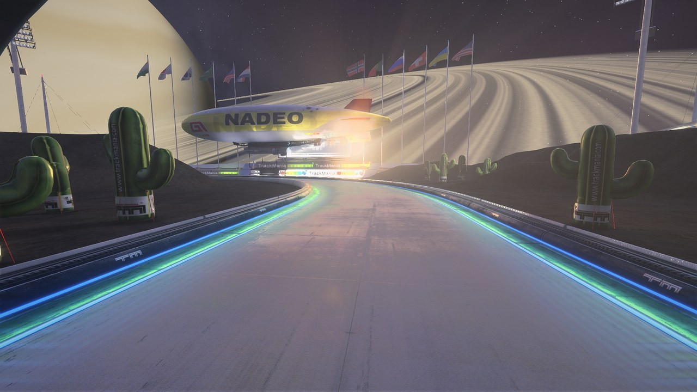
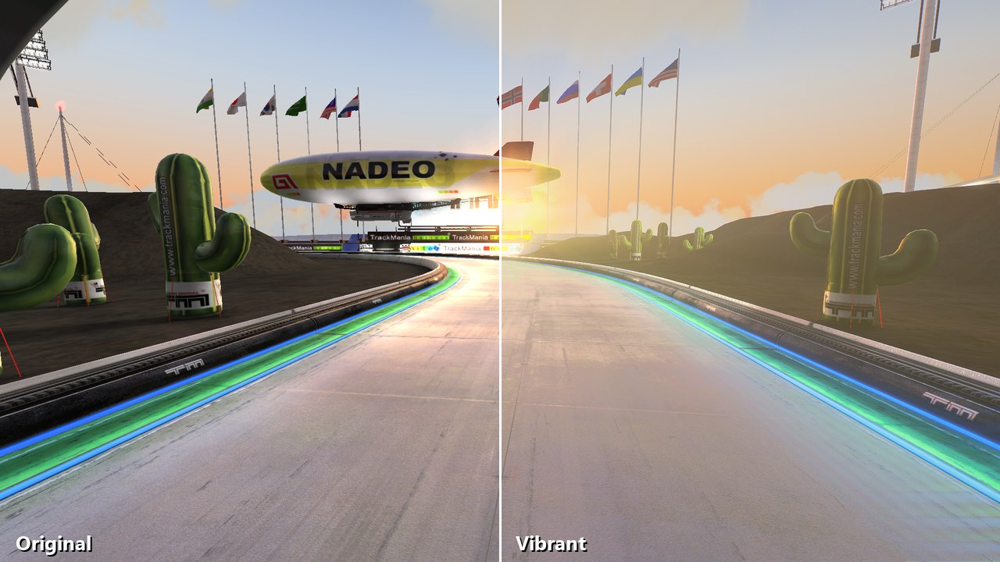
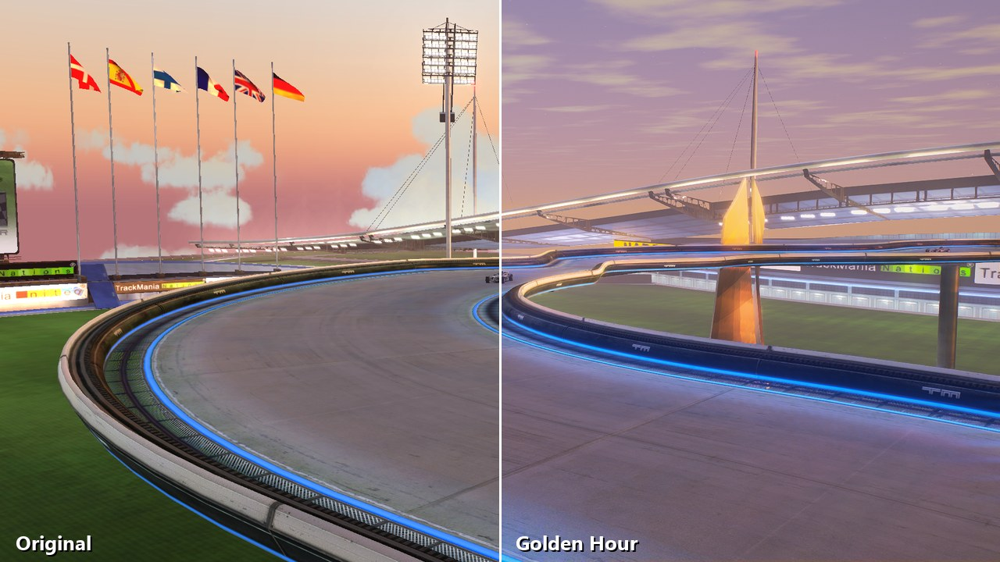
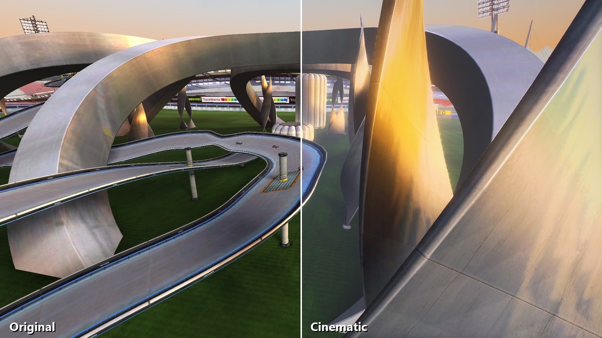
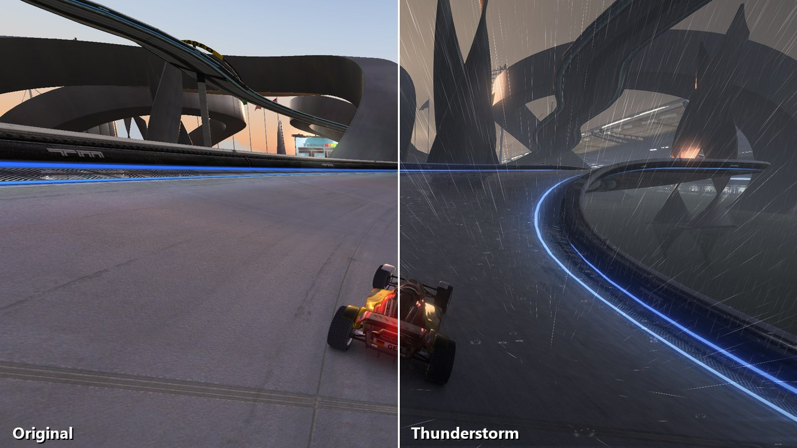
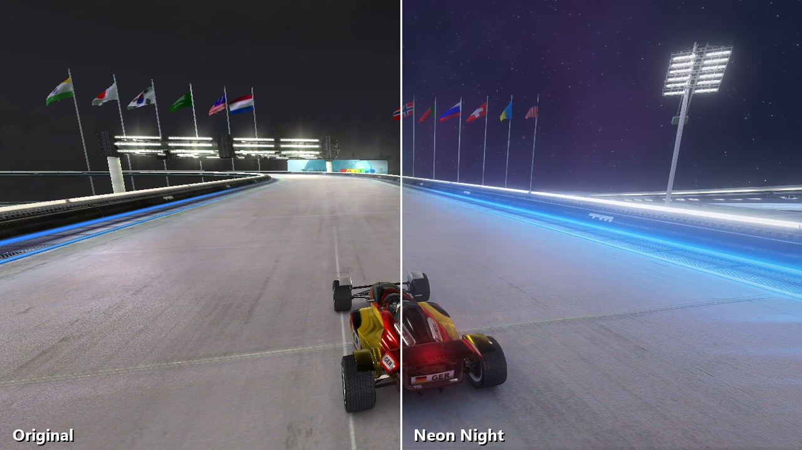
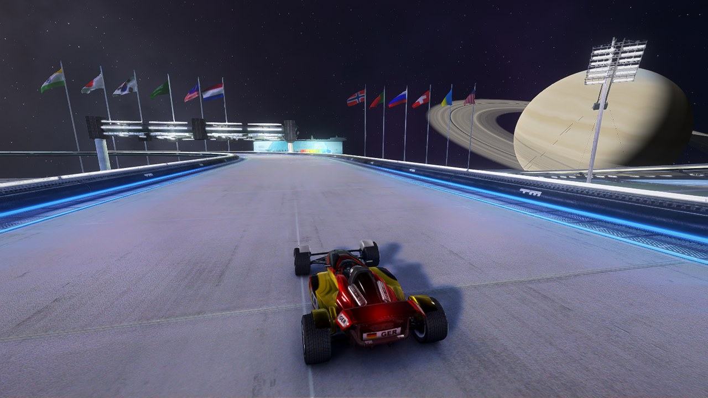
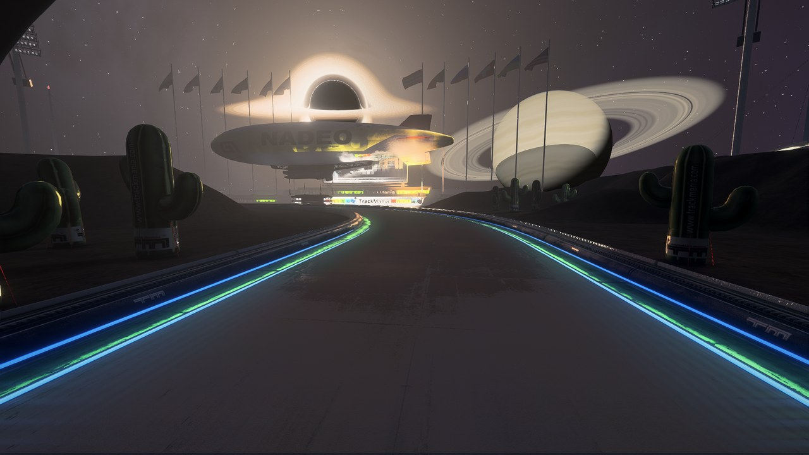
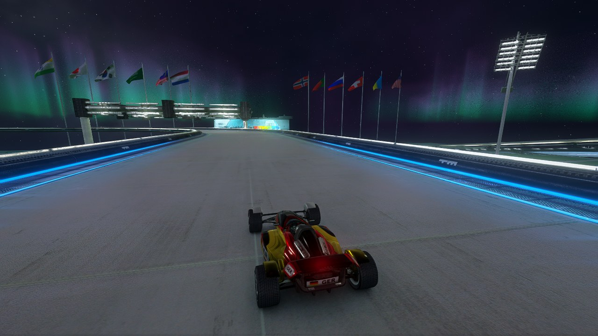
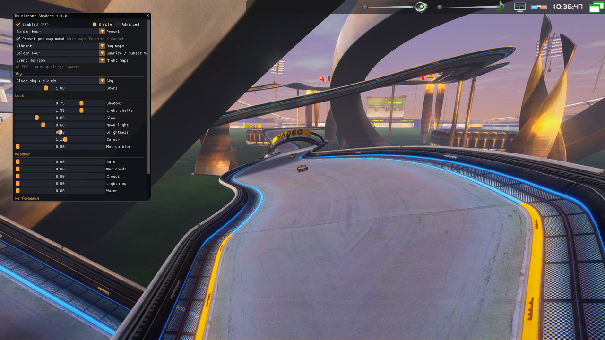

# TM Vibrant Shaders

**Real-time lighting, weather and skies for TrackMania Nations Forever and United Forever.**

[](https://github.com/cheatoskar/tmnf-vibrant-shaders/releases/latest)
[](https://github.com/cheatoskar/tmnf-vibrant-shaders/actions/workflows/build.yml)


TM Vibrant Shaders hooks into the game's renderer, reads the depth buffer, the camera and the sun, and lights the scene again on top of the game's own image: real shadows, ambient occlusion, light shafts, glowing neon, wet roads with reflections, rain that falls and splashes, volumetric clouds and entirely new skies. Everything is drawn before the HUD, so the interface stays sharp, and it works in replays and the video export too.



| | |
|---|---|
|  |  |
|  |  |
|  |  |
|  |  |

**[Download](https://github.com/cheatoskar/tmnf-vibrant-shaders/releases/latest)** · [Installation](#installation) · [Presets](#presets) · [Hardware and FPS](#recommended-hardware) · [All settings](#all-settings)

---

## Features

**Light and shadow**
- Ambient occlusion in corners, under barriers and around cars.
- Sun shadows traced against the depth buffer, plus **long-range shadows**: the mod builds a height map of the track as you drive, so a low sun throws long shadows, even from things that are off screen.
- Warm sunlight, sky-coloured shade, light shafts and height fog.
- **Neon light:** the blue and green borders and other coloured lights light up the road and walls around them, all the way down the track.

**Weather and surfaces**
- **Rain** as real particles: drops that fall around you and streak with your speed, splashes on the track, ripples in the puddles.
- Wet roads and puddles with screen-space reflections of the scenery and the lights.
- **Thunderstorms** with lightning that lights up the clouds and the track.
- Grass detail: patches, stadium mowing stripes and blades close to the camera.
- Water surfaces with waves and reflections (TMUF Island, Bay and Coast; experimental).

**Sky**
- Volumetric clouds, ray-marched and lit by the sun.
- Clear sky, starry night with shooting stars, aurora.
- A black hole rendered by bending light through curved space-time. It lights the scene like a second sun.
- **Ring World:** Saturn, Jupiter, an ice giant or an exotic gas giant over the stadium. Look at it from far away, from next to the rings, or float right above them.
- Night skies work on day maps: the game's baked-in sunlight is taken out.

**Camera**
- HDR glow, bloom, auto exposure and a filmic tone curve.
- Temporal anti-aliasing (TAA) plus FXAA, and AMD CAS sharpening.
- Motion blur and depth of field for replays and the video export.

**Made to be used**
- An `F8` menu with a **Simple** view for the everyday settings and an **Advanced** view with every value.
- **Auto quality** keeps your frame rate: it turns effects down when the GPU can't keep up, and back up when it can.
- The menu shows what each effect costs on your GPU, measured live.
- A preset per kind of map: day, sunset and night maps get their own look automatically.
- Your own presets, saved as small text files you can share.

---

## Presets

| Preset | What it looks like |
|---|---|
| **Vibrant** | The default. Warm sun, saturated colours, glowing borders, light shafts. |
| **Cinematic** | Dense sunlit haze, deep shadows, film contrast. |
| **Golden Hour** | New clear sky, low warm sun, long light shafts. |
| **Dreamy** | Soft pastel bloom, pink and teal. |
| **Neon Night** | Starry sky with shooting stars, bright neon that lights up the whole track. |
| **Event Horizon** | The Ring World sky at night: a gas giant with its rings and a glowing black hole over a dark, cold stadium. |
| **Aurora** | Northern lights, green and teal. |
| **Rainy Day** | Overcast clouds, wet track, puddles and rain. |
| **Thunderstorm** | Dark and soaked: low clouds, pouring rain, deep puddles, lightning. |
| **Replay Cinema** | Film look with a touch of motion blur and depth of field. Made for replays and the video export. |
| **Competition** | Clarity first: AO and contact shadows, no haze or lens effects. |
| **Performance** | Vibrant with the expensive parts switched off. |

Every sky works with every preset: pick *Ring world*, *Black hole*, *Aurora* and so on under **Sky** in the menu.

Change any value and the preset turns into **Custom**. Type a name and press **Save as preset** to keep it. While you're on *Custom*, a map change never swaps your tweaks for a mood preset.

---

## Recommended hardware

- **Minimum:** a GPU with Shader Model 3.0, like a GTX 750, HD 7750 or Intel UHD 620. Use the *Performance* preset and *Effect quality: Low*.
- **Recommended:** GTX 1060, RX 580, Radeon 780M or Intel Arc 140V. That's comfortable for Vibrant at 1080p.
- **Everything on, at 1440p or above:** RTX 3060 or GTX 1080 Ti and faster.

How much the shaders cost, at 1920×1080, looking into the sun (the worst case):

| GPU | Game without shaders | Performance | Vibrant | Replay Cinema |
|---|---|---|---|---|
| Intel Iris Xe (laptop) | ~90 FPS | 10.0 ms, ~45 FPS | 17.0 ms, ~35 FPS | 23.5 ms, ~30 FPS |
| GTX 1050 | ~200 FPS | 8.4 ms, ~75 FPS | 14.3 ms, ~50 FPS | 19.7 ms, ~40 FPS |
| Radeon 780M (laptop) | ~160 FPS | 5.2 ms, ~85 FPS | 8.9 ms, ~65 FPS | 12.3 ms, ~55 FPS |
| **Intel Arc 140V (measured)** | ~115 FPS | 3.7 ms, ~80 FPS | 6.3 ms, ~65 FPS | 8.7 ms, ~55 FPS |
| GTX 1060 6 GB / RX 580 | ~300 FPS | 3.6 ms, ~145 FPS | 6.1 ms, ~105 FPS | 8.4 ms, ~85 FPS |
| RTX 3060 | ~400 FPS | 1.8 ms, ~235 FPS | 3.0 ms, ~180 FPS | 4.1 ms, ~150 FPS |
| GTX 1080 Ti | ~400 FPS | 1.6 ms, ~245 FPS | 2.6 ms, ~195 FPS | 3.7 ms, ~160 FPS |
| RTX 4070 | ~450 FPS | 0.9 ms, ~320 FPS | 1.5 ms, ~270 FPS | 2.1 ms, ~230 FPS |

Only the Arc 140V row is measured. The other rows are **estimates**: the measured shader time scaled by each card's relative speed, on top of a typical frame rate for the bare game. Your numbers will differ with CPU, drivers and map. At 1440p expect about 1.8× the shader time, at 4K about 4×.

Most presets cost about as much as Vibrant. Thunderstorm costs about 20% more, Golden Hour and Event Horizon (custom skies) about 40% more. Aurora is the heaviest sky, roughly 2× Vibrant.

What costs the most, if you want to win back FPS:

| Setting | Approx. cost on the Arc 140V |
|---|---|
| Light shafts (when the sun is on screen) | 1.1 ms |
| Long-range shadows | 0.8 ms |
| Temporal AA | 0.7 ms |
| Volumetric clouds | 1.5 ms |
| Reflections (wet / dry track) | 0.5–1 ms |
| Depth of field | 2 ms |
| Rain (particles and wet surfaces) | 0.5–1 ms |
| Effect quality High → Low | saves about 1 ms |

You don't have to tune this by hand. **Auto quality** (on by default) watches your frame rate and steps the effect quality down when it falls below the target FPS, and back up when there's room. It never touches your settings or presets, and it leaves them alone when the game itself (CPU, vsync) is the limit. The **Performance** section of the `F8` menu shows what every effect costs on your GPU right now, and how many FPS you'd get back by turning it off.

### Recommended game settings

These are the settings in TrackMania's own options (launcher → *Advanced*) that work best with the shaders:

| Game setting | Recommended | Why |
|---|---|---|
| Antialiasing | **Off** | The mod switches it off anyway (it needs a readable depth buffer) and uses its own FXAA and TAA. |
| Anisotropic filtering | **16x** | Costs almost nothing and keeps the road and the thin neon strips sharp far away, so they still glow at a distance. |
| Shadows | Complex | Fine. The block shadows come from the mod. |
| Shader quality | PC3 High | The richest base image to light. Lower works too, it just starts flatter. |
| Textures | High | |
| Geometry details | Normal | |
| FX post-processing | On or off | Try both: off avoids the game's own glow adding to the mod's bloom. |
| Water geometry, stadium water | On | |
| Trees | Always high quality | |

The shaders also work with everything on low: they only need the finished image and the depth buffer. The look then starts from a flatter image.

---

## Installation

**You need**
- TrackMania Nations Forever or United Forever on Windows 10 or 11.
- Optional: the [TrackMania ModLoader (TMLoader)](https://tomashu.dev/software/tmloader/). The mod also works without it.

### With the setup (easiest)
1. Download **`TM-Vibrant-Shaders.zip`** from [Releases](https://github.com/cheatoskar/tmnf-vibrant-shaders/releases) and extract it.
2. Close TrackMania and run **`TM-Vibrant-Shaders-Setup.exe`**. Pick one:
   - **Install for the TrackMania ModLoader.** Then tick *TM Vibrant Shaders* in the ModLoader and start the game.
   - **Install into the game folder (no ModLoader).** Pick your TrackMania folder (the one with `TmForever.exe`) and start the game as usual. Windows asks for admin rights if the game is in *Program Files*.

Run the setup again to update or uninstall. It isn't code-signed, so SmartScreen may warn you. Click *More info → Run anyway*, or install by hand. Every release lists SHA-256 checksums.

### By hand
- **ModLoader:** copy the `TM Vibrant Shaders` folder from the zip to `%LOCALAPPDATA%\TMLoader\database\TmForever\products\` and tick the mod in the ModLoader.
- **Without ModLoader:** copy `TM Vibrant Shaders\<version>\TMVibrantShaders.dll` next to `TmForever.exe` and rename it to **`d3d9.dll`**. This can't be combined with another `d3d9.dll`, for example ReShade.

Only use one of the two. If both are installed, only one copy runs.

Eine deutsche Anleitung gibt es in [docs/INSTALL_DE.md](docs/INSTALL_DE.md).

---

## Using it

| Key | What it does |
|---|---|
| `F8` | Opens and closes the menu. *Simple* shows the everyday settings (preset, sky, shadows, light shafts, weather, auto quality), *Advanced* shows everything, your own presets and the measured cost of every effect. |
| `F7` | Shaders on and off, for a quick before/after. |
| `F9` | Reloads the shaders (only useful while developing). |
| `F12` | Saves a frame capture. Attach it to bug reports. |



- Settings, your presets and the log are in `Documents\TrackMania\TMVS\`.
- **Preset per map mood:** pick a preset for day, sunset and night maps right in the menu (defaults: Vibrant, Golden Hour, Event Horizon). It switches when you load a map of that kind.
- **Sky rotation** and **Planet direction** turn the sky objects into view if they're behind you.

### Making your own preset

1. Pick the preset that's closest to what you want.
2. Open the menu with `F8`, switch to **Advanced** and change values. Everything updates live, and `F7` shows the original next to it.
3. Type a name into the field under the preset list and press **Save as preset**.

Presets are plain text files in `Documents\TrackMania\TMVS\presets\`, one `.ini` per preset. Send the file to a friend and they can drop it into the same folder. It shows up in their preset list next time the game starts. Delete a preset with the **Delete** button next to the list.

---

## All settings

<details>
<summary><b>Lighting</b></summary>

| Setting | What it does |
|---|---|
| Ambient occlusion | Darkens corners and contact areas. Higher = darker. |
| AO radius (m) | How far around a point the occlusion looks. Big values darken whole areas, small values only tight corners. |
| Sun shadows | Strength of the sun shadows. 0 turns them off. |
| Shadow ray length (m) | How far the short screen-space shadow rays travel. |
| Long-range shadows | Strength of the height-map shadows: long evening shadows and shadows from off-screen objects. |
| Long shadow range (m) | How far those shadows reach. |
| Neon light on surroundings | How much coloured lights (borders, signs) light up the surfaces around them. |
| Sunlight warmth | How strongly sunlit surfaces take on the sun colour. |
| Sky ambient tint | How strongly shaded surfaces take on the sky colour. |
| Sun colour | Colour of the sunlight. |
| Use game's sun colour | Mixes in the map's own light colour, so sunsets stay orange. 1 = only the game's colour. |
| Sky colour | Colour of the shade and ambient light. |
| Sun elevation / azimuth override | Moves the sun for the shaders. -1 = use the game's sun. |

</details>

<details>
<summary><b>Sky & Atmosphere</b></summary>

| Setting | What it does |
|---|---|
| Sky | Game sky, clear sky, starry night, black hole, aurora or ring world. |
| Night darkening | How much the scene is darkened under night skies. -1 = automatic. |
| Sky rotation | Turns stars, black hole, planets and aurora around you. |
| Sky brightness | Brightness of the custom skies. |
| Clouds (clear sky) | Amount of the flat clouds in the clear sky. |
| Stars | Number and brightness of stars, and how often shooting stars cross the sky. |
| Black hole size | Size of the black hole. Above 3 you are right at its edge, the disk sweeping across the sky. |
| Ringed planet | Size of the planet in the starry night and black hole skies, or of the ring world planet. 0 = none. |
| Ring world planet | Saturn, Jupiter, ice giant or exotic. |
| Ring world view | *Distant*: the classic view of a ringed planet. *Next to the rings*: just outside them, the rings cross the sky in front of the planet. *On the rings*: you float just above them, the banded rings stretch to the horizon. |
| Planet direction / height | Where the planet is in the sky. |
| Volumetric clouds | 3D clouds over any sky. 0 = off. |
| Cloud coverage | How much of the sky the clouds cover. |
| Cloud height (m) | Height of the cloud base. |
| Sky enhancement | Richer colour gradient on the game's own sky. |
| Sun glow | Glow and disc of the sun. |
| Haze density / height falloff | How thick the haze is, and how fast it thins out with height. |
| Haze sun scattering | How much the haze glows around the sun. |
| Light shafts / length | Strength and length of the sun rays. |

</details>

<details>
<summary><b>Weather & Surfaces</b></summary>

| Setting | What it does |
|---|---|
| Wet roads | Darker, shiny, reflective track. |
| Rain | Rain drops falling around you, splashes on the track, ripples on wet surfaces. |
| Puddles | Standing water on flat ground (needs wet roads). |
| Lightning | How often lightning flashes light up the sky and the track. |
| Water surfaces | Waves and reflections on open water (TMUF Island/Bay/Coast). Experimental: it detects water by colour. |
| Track reflections (dry) | Glossy reflections on dry track. |
| Grass detail | Grass patches and blades close to the camera. |
| Mowing stripes | Stadium-style stripes in the grass. |
| Wind | Speed of rain slant, grass and clouds. |

</details>

<details>
<summary><b>Cinematic</b></summary>

| Setting | What it does |
|---|---|
| Motion blur | Blur from camera movement. 1 = one full frame of movement. Your car stays sharp in the chase camera. |
| Depth of field | Background and foreground blur. |
| Focus distance (m) | 0 = auto focus on what's in the middle of the screen. |
| Max blur (px) | Largest blur size, at 1080p. |

</details>

<details>
<summary><b>Bloom & Lens</b></summary>

| Setting | What it does |
|---|---|
| Bloom | Soft glow around bright parts. |
| Bloom radius | Wider or tighter glow. |
| Light source intensity | How bright lamps and neon become in HDR. |
| Lens flare | Ghost reflections from the sun. |
| Chromatic aberration | Colour fringes towards the screen edges. |
| Vignette | Darker screen corners. |
| Film grain | Fine film noise. |

</details>

<details>
<summary><b>Colour</b></summary>

| Setting | What it does |
|---|---|
| Exposure (EV) | Overall brightness. |
| Auto exposure | How much the brightness adapts to the scene, like an eye. |
| Contrast, Saturation | Usual meaning. |
| Vibrance | Saturates dull colours more than already strong ones. |
| Temperature, Tint | Warmer/cooler, greener/pinker. |
| Lift, Gamma, Gain | Brightness of shadows, mid-tones and highlights. |
| Split toning | Cool shadows and warm highlights. |

</details>

<details>
<summary><b>Image</b></summary>

| Setting | What it does |
|---|---|
| FXAA anti-aliasing | Smooths edges within a frame. |
| Temporal anti-aliasing | Smooths edges and flicker over several frames. Some softness on fast movement. |
| Sharpening (CAS) | Gets back detail after anti-aliasing. |
| Effect quality | Number of samples for AO, shadows and clouds. Low is noticeably faster. |
| Auto quality | Lowers the effect quality on its own when the frame rate drops below the target. |
| Auto quality: target FPS | The frame rate auto quality tries to hold. |
| Disable game MSAA (restart) | Needed for the depth effects. Leave it on. |
| Effects in replay/video export (restart) | Also hooks the depth buffers the game uses for replays and the video export. |

</details>

---

## Troubleshooting

- **No effects in game.** Look at `Documents\TrackMania\TMVS\tmvs.log`. It shows whether the depth buffer and the engine hooks were found.
- **Edges look jaggier than before.** The game's own MSAA is switched off on purpose, because the depth effects need a plain depth buffer. FXAA and TAA replace it.
- **Low FPS.** Try *Performance*, set *Effect quality* to Low, or switch off the costly settings from the table above.
- **Uninstall.** Run the setup and choose *Uninstall*, untick the mod in the ModLoader, or delete `d3d9.dll` from the game folder.

---

## How it works

- **Loading.** The DLL is loaded by the ModLoader, or by the game itself as `d3d9.dll`. In that case it passes every Direct3D call on to the real `d3d9.dll` from Windows.
- **Where it draws.** It runs at the end of the game's 3D camera (`CVisionViewportDx9`, found through the game's symbol map), before the HUD.
- **Depth.** The game's depth buffer is swapped for a readable INTZ texture.
- **Camera and sun** come from the game's own Direct3D 9 calls.
- **Passes.** Everything is ps_3_0 pixel shaders, in this order: depth and normals → height map for long shadows → AO and shadows → sky and clouds → reflections and neon light → lighting → depth of field and motion blur → light shafts → bloom → exposure → tone mapping → FXAA → TAA → sharpening.
- The shaders are compiled when the mod is built, so the game doesn't stall at start-up.

### Building from source

You need Visual Studio 2022 (C++ desktop workload), the Windows 10/11 SDK and CMake 3.21 or newer.

```powershell
cmake -B build -A Win32
cmake --build build --config Release                       # plugin, setup, previewer
cmake --build build --config Release --target release_zip  # dist/: zip, DLL, SHA256SUMS.txt
powershell -ExecutionPolicy Bypass -File .\install-modloader.ps1   # install the local build
```

`tmvs_preview` renders `F12` captures through the same pipeline outside the game. `--bench` prints the GPU time per pass, and `--batch` renders many variants in one go.

---

## Credits

- [Dear ImGui](https://github.com/ocornut/imgui) (MIT) for the menu, see [THIRD_PARTY_NOTICES.md](THIRD_PARTY_NOTICES.md).
- Anti-aliasing and sharpening follow **FXAA 3.11** (Timothy Lottes) and **AMD FidelityFX CAS**.
- TrackMania is a trademark of Ubisoft / Nadeo. This is a fan project and has nothing to do with them.

## License

© 2026 Oskar (cheatoskar). For now this is **source-available, not open source**. You can use the releases for free, also in videos and streams, read the code, and contribute through issues and pull requests. You can't redistribute it or publish modified versions. Details in [LICENSE](LICENSE). It will move to an open-source license once the shaders are final.
